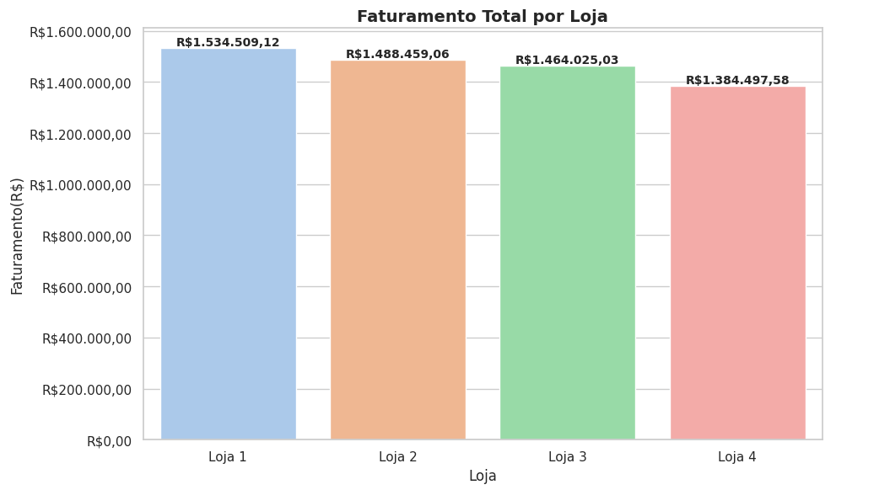
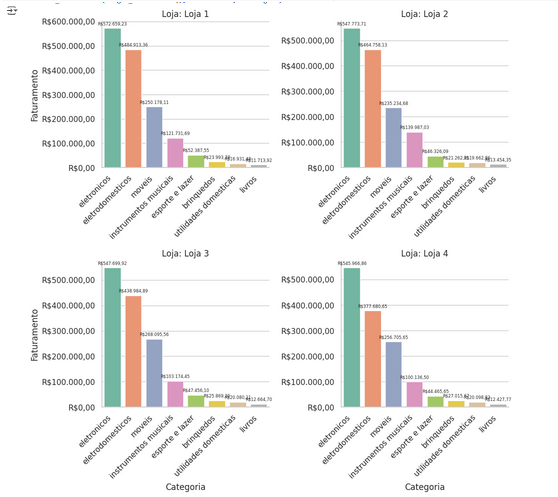
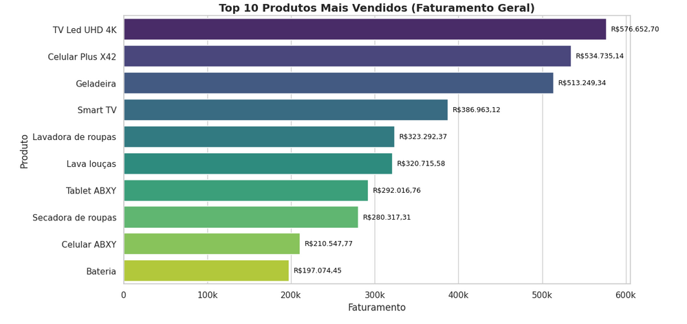
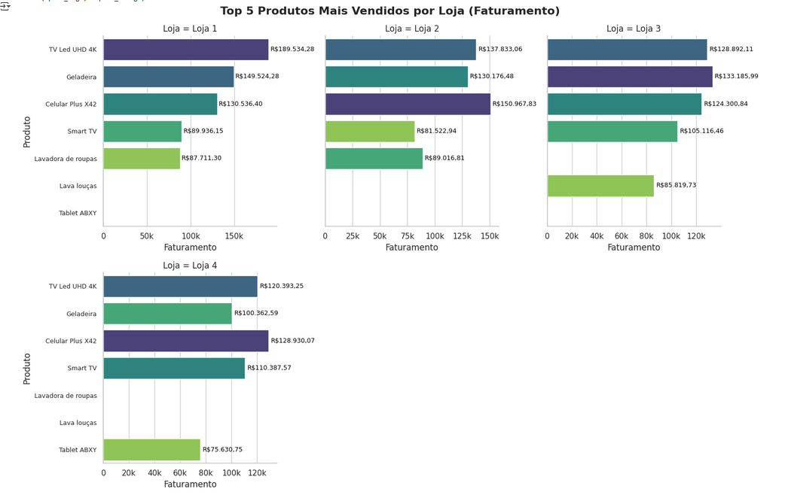
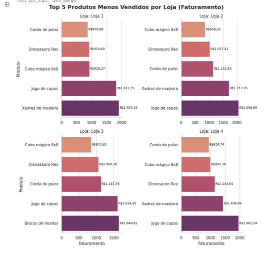
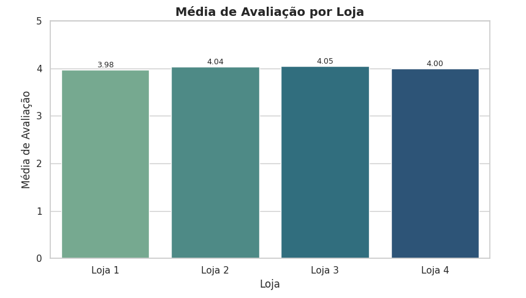
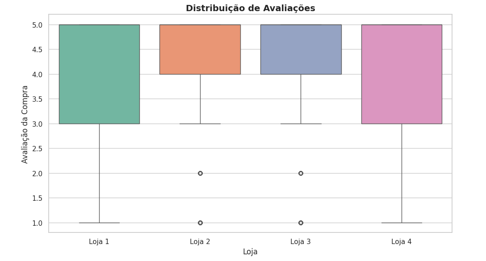
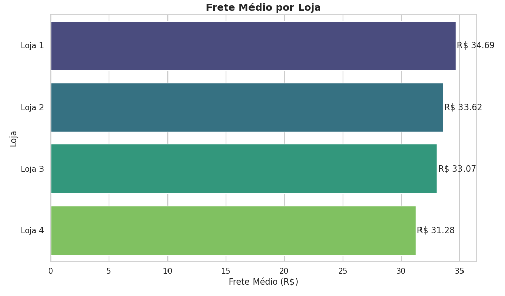

# 📊 Análise de Desempenho Alura Store 

Este reposiório condensa uma análise exploratória de dados(EDA) de 4 lojas para auxiliar na tomada de decisão. Este projeto faz parte da formação em Data Science do programa Oracle Next Education + Alura 

## 📌 Visão Geral
Este projeto visa analisar os dados de 4 lojas para entender qual loja deve ser vendida e os motivos que sustentam a escolha, tudo baseado em dados. Utilizei técnicas de análise de dados, como a análise exploratória de dados(EDA) para compreender os dados históricos das lojas e com isso conseguir auxiliar o dono da empresa a tomar a melhor decisão estratégica. 

## 💼 Entendimento do Negócio 
Durante este desafio, você irá ajudar o Senhor João a decidir qual loja da sua rede Alura Store vender para iniciar um novo empreendimento. Para isso, você analisará dados de vendas, desempenho e avaliações das 4 lojas fictícias da Alura Store. O objetivo é identificar a loja com menor eficiência e apresentar uma recomendação final baseada nos dados. 

* **Analisar os dados das lojas:**

 Avaliar informações como faturamento, categorias mais vendidas, avaliações dos clientes, produtos mais vendidos e frete médio.

* **Criar gráficos para visualização:**

 Decida quais tipos de gráficos usar para apresentar os resultados de maneira clara e visual.

    
* **Apresentar uma recomendação:**

 Após as análises, escreva um texto explicando qual loja deve ser vendendida e por quê, com base nos dados apresentados. 

 --- 

 ## 📈 Principais Análises

 ### Faturamento 
Na análise de faturamento observou-se que na análise de cerca de 2359 vendas em cada uma das lojas o faturamento bruto foi maior na loja 1 e ticket médio já a loja que apresentou o menor faturamento foi a loja 4, conforme foi possível verificar com o gráfico.  

 

--- 

### Ticket médio 

| Loja  | Faturamento Total (R$) | Quantidade de Vendas | Ticket Médio (R$) |
|-------|------------------------|----------------------|-------------------|
| Loja 1 |  R$ 1.534509,12 	      | 2359                | R$ 650,49 |
| Loja 2 |  R$ 1.488459,06 	      | 2359                | R$ 630.97 |
| Loja 3 |  R$ 1.464025,03        |  2359               | R$ 620.61 |
| Loja 4 |  R$ 1.384497,58        | 2358                | R$ 587.15 | 

--- 

### Vendas Por Categoria 

   * As categorias de eletronicos, eletrodomesticos e móveis são as categorias que trazem o maior faturamento geral (todas as lojas).

   * Dentre as lojas, a loja 1 possui o maior faturamento nessas categorias.

   * A Loja 4 de novo, apresenta o pior desempenho em comparação as demais lojas

 

---

### Produtos mais vendidos (faturamento geral) 

  

---

### Top 5 produtos mais vendidos por cada loja 

  

---

### Produtos menos vendidos (faturamento geral) 

 

--- 
### Avaliação Média 

 --- 
 ### Distribuição da avaliação entre as lojas 

  

 --- 
 ### Frete médio por loja 
  

 ## 📈 Insights e Conclusões 
 A análise dos principais aspectos já mencionados identificou que: 

 1. A **loja 1** possui o maior faturamento e ticket médio, ficando apenas um pouco abaixo na avaliação média dos clientes.
 2. A **loja 2** possui o segundo melhor faturamento geral e boa avaliação.
 3. A loja 3 foi a mais bem avaliada em média e faturamento dentro do esperado.
 4. A **loja 4** apresentou o menor faturamento geral e ticket médio

* **Recomendação:** O critério para restruturação ou venda de uma das lojas para novos investimentos deve considerar o baixo desempenho comparativo que pode ser observado na loja 4. Para algo diferente disso, seria necessário mais dados para compor a análise. A priori, a reestruturação ou venda da loja 4, é recomendada.

